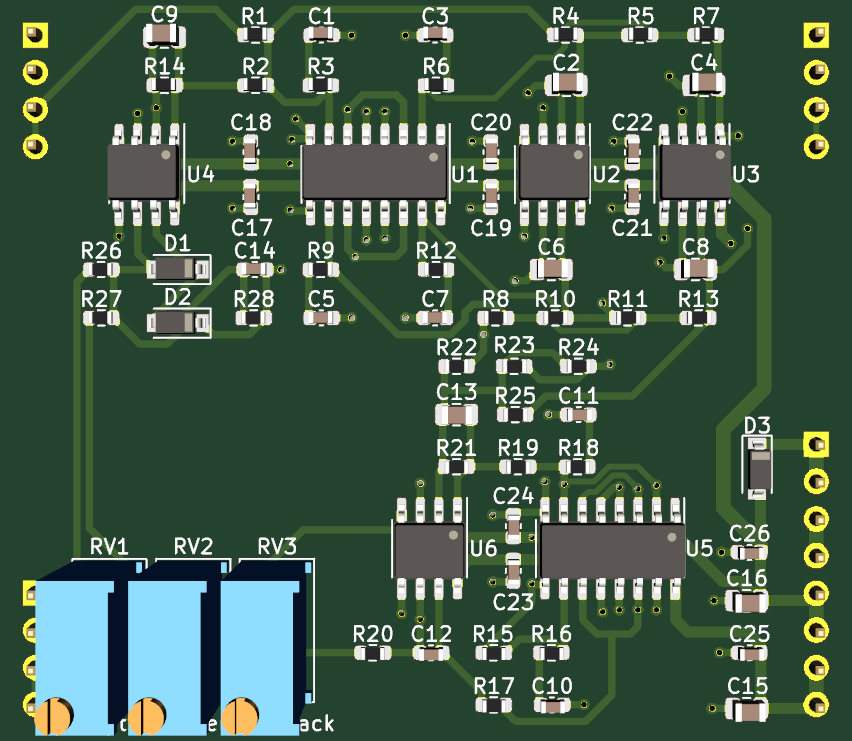

## SSI2164 4-pole Low Pass Filter plug-in board

Small SSI2164 based low pass filter PCB, designed to plug into a larger motherboard.

## Details

This pcb uses the 4-pole band-pass feedback as a means of Q-compensation as outlined in application note AN701.

Voltage controlled feedback is provided, consistent with the other filter plug-in boards.

Construction documents for the low cost pcb assembly service from JLCPCB are included. A few parts are not included in the assembly documents, such as the through hole components, the SSI2164 chips, and also the 220pf timing capacitors for the filter stages. These are left to the builder to install. These should be good quality C0G/NP0 0805 capacitors with 2% or better tolerance.

There are also footprints for optional capacitors across the feedback amplifier gain setting resistors (C9 and C13). Placing small value capacitors here can tame excessive feedback at high frequencies, or address instability if it is observed.

## Inputs

-Audio in: dry audio input to be filtered.

-Frequency CV in: 0 volts to +2.048 volts, higher voltage = higher sweep.

-Feedback CV in: 0 volts to +2.048 volts, higher voltage = more feedback.

## Outputs

-Audio out: filtered audio output.

## Power Supply Requirements

A bipolar 12 volt power supply is required. This will typically come from the motherboard.

## Calibration

- See the top level README for calibration instructions.
