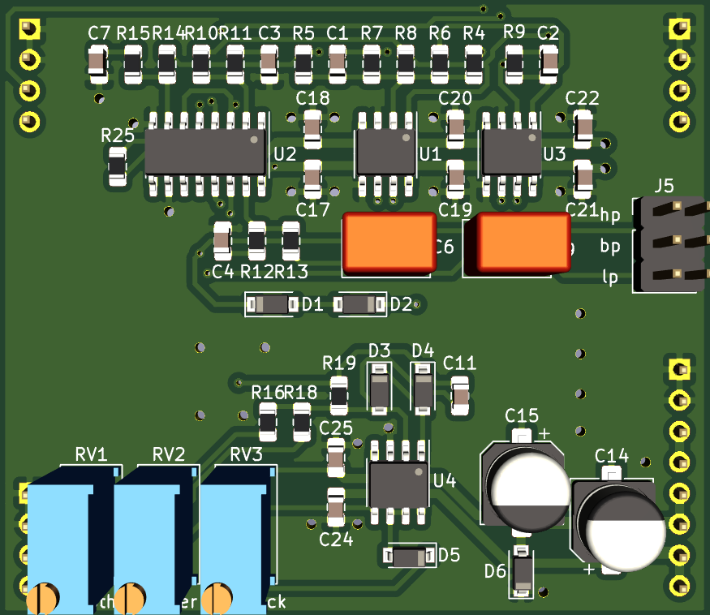

# 2164 State Variable Filter Plug-In Board

Small SSM/V/SSI2164 based state variable filter PCB, designed to plug into a larger motherboard.

## Details

2164 based SVF with low pass, band pass, and high pass modes available. This PCB includes the audio path and CV inputs for frequency and feedback, but does not include any modulation sources.

The intended use for this board is to plug in to a larger motherboard which contains slots for one or more of these plug-in boards, as well as modulation sources, panel controls, and input/output routing.

## Inputs

-Audio in: dry audio input to be filtered.

-Frequency CV in: 0 volts to +2.048 volts, higher voltage = higher sweep.

-Feedback CV in: 0 volts to +2.048 volts, higher voltage = more feedback.

## Outputs

-Audio out: filtered audio output.

## Filter mode selection

- This filter has three filter modes available: Low Pass, Band Pass, and High Pass.

- One mode at a time can be selected with a jumper.

## Power Supply Requirements

A bipolar 12 volt power supply is required. This will typically come from the motherboard.

## Calibration

- See the top level README for calibration instructions.
