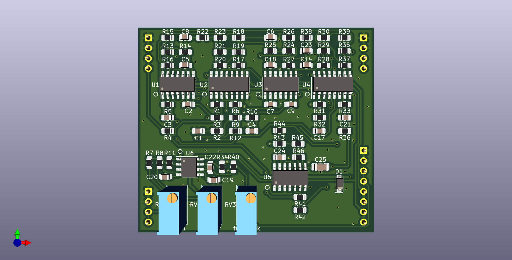

# 2164 Phasor Plug-In Board

Small 6 stage SSM2164 based phase shifter PCB, designed to plug into a larger motherboard.

## Details

Six stage phase shifter implemented with SSM2164/V2164/SSI2164 quad VCAs. This PCB includes the audio path and CV inputs for frequency and feedback, but does not include any modulation sources.

The intended use for this board is to plug in to a larger motherboard which contains slots for one or more of these plug-in boards, as well as modulation sources, panel controls, and input/output routing.

## Inputs

-Audio in: dry audio input to be phase shifted.

-Frequency CV in: 0 volts to +2.048 volts, higher voltage = higher sweep.

-Feedback CV in: 0 volts to +2.048 volts, higher voltage = more feedback.

## Outputs

-Audio out: phase shifted audio output.

## Power Supply Requirements

A bipolar 12 volt power supply is needed. This will typically come from the motherboard.

## Calibration

- See the top level README for calibration instructions.
