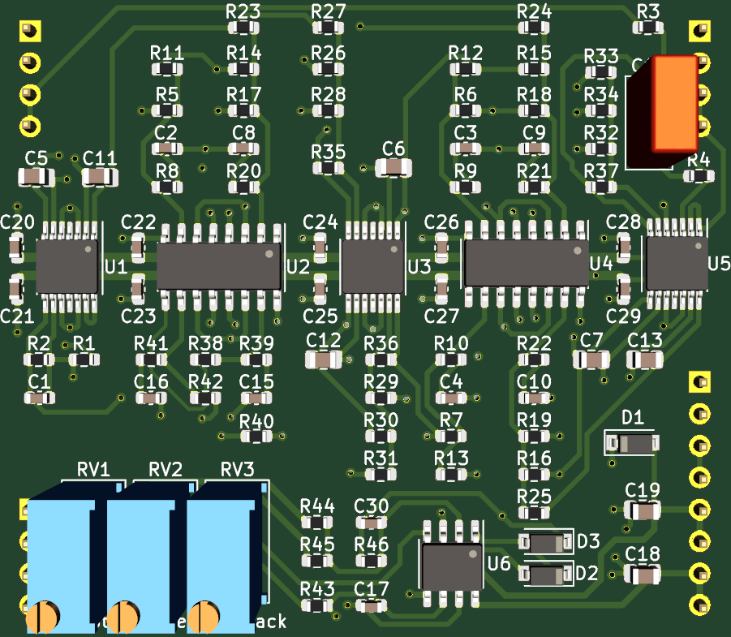

# 2164 Phasor Plug-In Board

Small 6 stage SSM2164 based phase shifter PCB, designed to plug into a larger motherboard.

## Details

Six stage phase shifter implemented with SSI2164 quad VCAs.

Voltage controlled feedback is provided, consistent with the other filter plug-in boards.

Construction documents for the low cost pcb assembly service from JLCPCB are included. A few parts are not included in the assembly documents, such as the through hole components, the SSI2164 chips, and also the 220pf timing capacitors for the filter stages. These are left to the builder to install. These should be good quality C0G/NP0 0805 capacitors with 2% or better tolerance.

## Inputs

-Audio in: dry audio input to be phase shifted.

-Frequency CV in: 0 volts to +2.048 volts, higher voltage = higher sweep.

-Feedback CV in: 0 volts to +2.048 volts, higher voltage = more feedback.

## Outputs

-Audio out: phase shifted audio output.

## Power Supply Requirements

A bipolar 12 volt power supply is needed. This will typically come from the motherboard.

## Calibration

- See the top level README for calibration instructions.
