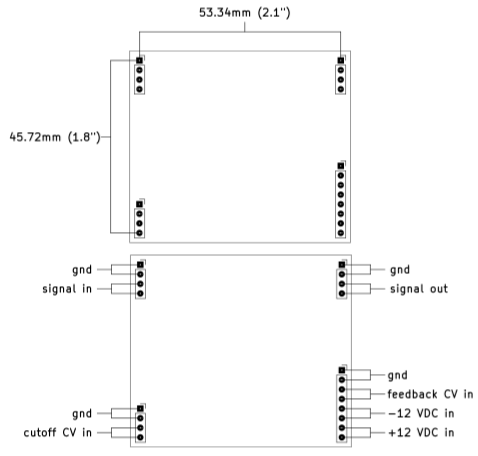

# Various Voltage Controlled Filter pcbs

- #### These small VCF "plug-in" boards each contain a filter "core". These are intended to be plugged into a motherboard which provides a +/- 12 volt power supply, input/output circuitry, and control voltage sources.
- #### They all share an identical mechanical and electrical format.
- #### The intended use is to make a bunch of different filters and then be able to easily try them out by swapping the filter plug-in boards into the motherboard.

## The mechanical format and pinout shared by all plug-in boards:

## Signal levels:
- #### The plug-in boards are expecting modular synthesizer level signals of around +/- 5 volts.
- #### Many filters have interesting resonance and distortion characteristics that depend on signal level. Experiment with increasing and decreasing the signal levels to find the sweet spots.
- #### The output signal may or may not be in phase with the input signal.

## CV signals:
- #### The motherboard is expected to provide a 0 to +2.048 volt cutoff frequency CV signal. The plug-in boards are designed to sweep through their entire range with this range, with 0 volts mapping to the lowest cutoff frequency (usually around 20Hz) and +2.048 volts mapping to the highest cutoff frequency (usually around 20kHz).
- #### The feedback CV from the motherboard uses the same range: 0 volts of feedback CV maps to "no feedback" and +2.048 volts of feedback CV maps to maximum feedback.
- #### The CV range of 0 to +2.048 volts was chosen becuase it allows the cutoff and feedback CV signals to be conveniently driven directly from a cheap MCP4822 DAC. Don't worry about an exact 2.048 volt range, the filters have trimmers to account for variations.
- #### If different scalings are desired it is usually fairly trivial to change some resistor values in the CV scaling circuits on the plug-in boards.

## Feedback considerations:
- #### The plug-in boards all have voltage controlled feedback. This makes it easier to swap them in and out of a motherboard without worrying about the type and value of feedback potentiometer.
- #### This also makes it easier to apply "Q-compensation" to 4-pole low pass filters that suffer from passband attenuation when feedback is increased.
- #### All 4-pole filters have some form of Q-compensation built in. The builder can usually adjust the amount of compensation, or choose no compensation at all by changing a single resistor.

## Calibration:
- #### Each plug-in board has calibration trimpots for modulation depth, center frequency, and feedback sensitivity.
- #### For filters that can track at 1 volt per octave, they can probably be trimmed to play in tune over a limited range, but the trimming may be fiddly. Emphasis has been placed on getting a nice sweep through the filters useful range, and not accurate tuning or temperature compensation.
- #### Calibration is a matter of taste, and any setup that sounds good to you is correct.
- #### Here is how I calibrate Low Pass Filters:
    1. Inject a 30Hz square wave onto the signal input while monitoring the signal output.
    2. Turn the cutoff CV and feedback CV signals all the way down (set them to zero volts).
    3. Adjust the **center** trim so that the signal just dissapears.
    4. Remove the signal input.
    5. Turn the cutoff CV to around 1/2 way up and turn the feedback CV all the way up.
    6. Adjust the **feedback** trim until self oscillation occurs.
    7. Turn the cutoff CV signal all the way up.
    8. Adjust the **depth** trim until the frequency of the self oscillation is around 20kHz.
    9. Sweep the cutoff frequency up and down and readjust the **feedback** trim as needed to get reliable self oscillation over the desired range. Note that some filters will not self oscillate over their whole frequency range.
    10. Now reinject the signal and listen to the filter while changing the cutoff and feedack CV signals. Readjust the trimmers to taste if desired.

- #### I use a similar strategy for other filter topologies like Phase Shifters. Without a self oscillation signal or a strong sense of "cutoff frequency", just adjust the trimmers so that the filter has a nice sweep and the feedback control feels good.
- #### The above calibration strategy is very quick and easy once you've done it a few times.

## Power supply considerations:
- #### The motherboard is expected to provide a +/-12 volt DC power supply.
- #### Current draw varies across the filter boards from a handfull of milliamps to a few 10's of milliamps.
- #### Ensure that the motherboard can supply at least 100mA or so on each rail.

## Starting new plug-in board pcbs:
- #### A template is provided to make it easy to start new plug-in board filters.
- #### This template contains a standard directory structure, and the start of a kicad project.
- #### The template kicad docs have the skeleton of the schematic and pcb.

## Project structure:
- #### Each filter plug-in board subdirectory follows a consistent structure:
    - #### `kicad_docs/` contains the files needed to open and edit the filter schematic and pcb layout using kicad.
    - #### `construction_docs/` contains a pdf copy of the schematic, an interactive BOM which can be opened in a web browser, and gerbers.
    - #### `pics/` contains a few rendered pics of the pcb.
- #### Basically, if you want to edit the filter go into `kicad_docs/`, if you want to build the filter go into `construction_docs/`.
- #### Note that the filters may be a work in progress and may not contain complete documentation until they are done.
- #### See the board status checklist below, any board that is not checked all the way across is likely to contain errors. Boards that are all checked all the way across are safe to build.

## Status of the boards:

Board | breadboarded | schematic | pcb layout | built and tested | documentation
------|--------------|-----------|------------|------------------|---------------
[2164 phasor](https://github.com/JordanAceto/VCF_plug_in_boards/tree/master/2164_phasor_plug_in_board)       | &#9745; | &#9745; | &#9745; | &#9744; | &#9744;
[arp 4072 LPF](https://github.com/JordanAceto/VCF_plug_in_boards/tree/master/arp_4072_LPF_plug_in_board)      | &#9745; | &#9745; | &#9745; | &#9745; | &#9745;
[CEM3320 LPF](https://github.com/JordanAceto/VCF_plug_in_boards/tree/master/CEM3320_LPF_plug_in_board)       | &#9745; | &#9745; | &#9745; | &#9745; | &#9745;
[haible 2040 LPF](https://github.com/JordanAceto/VCF_plug_in_boards/tree/master/haible_2040_LPF_plug_in_board)   | &#9745; | &#9744; | &#9744; | &#9744; | &#9744;
[haible tau phasor](https://github.com/JordanAceto/VCF_plug_in_boards/tree/master/haible_tau_phaser_plug_in_board/kicad_docs) | &#9744; | &#9744; | &#9744; | &#9744; | &#9744;
[Late MS20 VCF](https://github.com/JordanAceto/VCF_plug_in_boards/tree/master/late_MS20_VCF_plug_in_board)       | &#9745; | &#9745; | &#9745; | &#9745; | &#9745;
[minimoog LPF](https://github.com/JordanAceto/VCF_plug_in_boards/tree/master/minimoog_LPF_plug_in_board)      | &#9745; | &#9745; | &#9745; | &#9745; | &#9745;
[mutron 3 SVF](https://github.com/JordanAceto/VCF_plug_in_boards/tree/master/mutron_III_plug_in_board)      | &#9745; | &#9745; | &#9745; | &#9745; | &#9745;
[optical phasor](https://github.com/JordanAceto/VCF_plug_in_boards/tree/master/optical_phasor_plug_in_board)    | &#9745; | &#9745; | &#9745; | &#9745; | &#9745;
[SSI2164 LPF](https://github.com/JordanAceto/VCF_plug_in_boards/tree/master/SSI2164_4_pole_LPF_plug_in_board)       | &#9745; | &#9745; | &#9745; | &#9745; | &#9745;
[SSI2164 SVF](https://github.com/JordanAceto/VCF_plug_in_boards/tree/master/2164_SVF_plug_in_board)       | &#9745; | &#9745; | &#9745; | &#9745; | &#9745;
