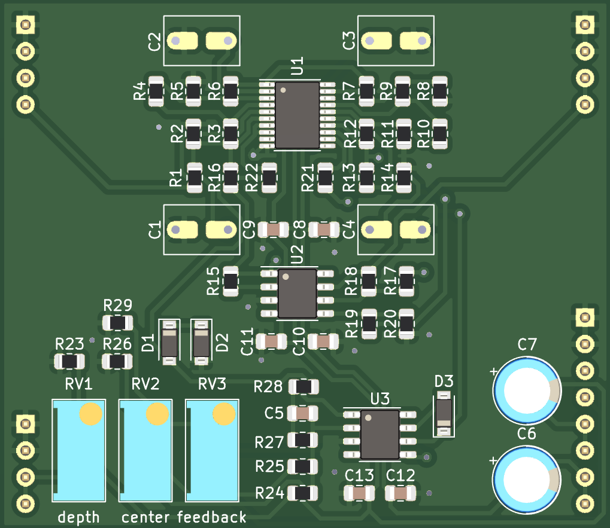

## SSI2140 4-pole Low Pass Filter plug-in board

Small SSI2140 based low pass filter PCB, designed to plug into a larger motherboard.

## Details

Basic datasheet implementation of the SSI2140 lowpass filter with "Output Gain" Q Compensation.

## Inputs

-Audio in: dry audio input to be filtered.

-Frequency CV in: 0 volts to +2.048 volts, higher voltage = higher sweep.

-Feedback CV in: 0 volts to +2.048 volts, higher voltage = more feedback.

## Outputs

-Audio out: filtered audio output.

## Power Supply Requirements

A bipolar 12 volt power supply is required. This will typically come from the motherboard.

## Calibration

-RV1 (depth trim): trims the depth of incoming frequency CV signals. Turn CW for greater depth and CCW for less depth. Adjust to taste.

-RV2 (center trim): trims the center frequency of the filter. Turn CW for higher center frequency and CCW for lower center frequency. Adjust to taste.

-RV3 (feedback trim): trims the maximum amount of feedback. Turn CW for more maximum feedback and CCW for less maximum feedback. Exercise caution when adjusting this, as extreme settings can result in loud oscillations which could damage your ears or speakers if you are monitoring the sound with a loud amplifier. If you set this trimmer to be right on the edge of oscillation when about +2 volts is applied to the feedback CV input then make sure to sweep the frequency through its entire range, as a setting that doesn't squeal at certain frequency settings may squeal at other settings.
