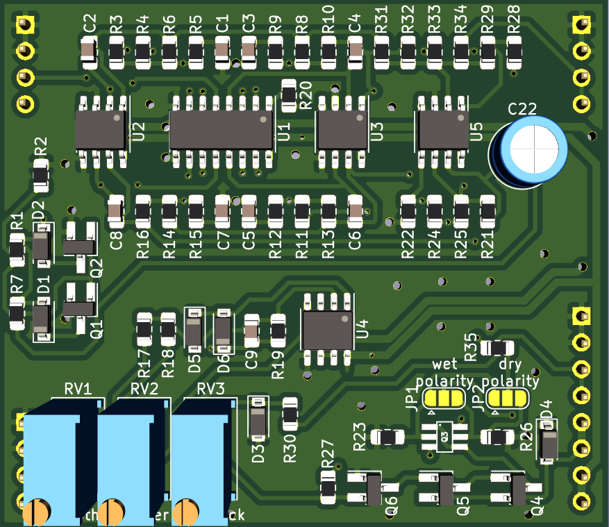

## SSI2164 4-pole Low Pass Filter plug-in board

Small SSI2164 based low pass filter PCB, designed to plug into a larger motherboard.

## Details

This pcb is set up as an "experimenters board" for trying out the 2 and 4-pole band-pass feedback as a means of Q-compensation in application note AN701. Various feedback configurations are possible, and the exact configuration is left up to the builder.

Voltage controlled feedback is provided, consistent with the other filter plug-in boards.

## Inputs

-Audio in: dry audio input to be filtered.

-Frequency CV in: 0 volts to +2.048 volts, higher voltage = higher sweep.

-Feedback CV in: 0 volts to +2.048 volts, higher voltage = more feedback.

## Outputs

-Audio out: filtered audio output.

## Power Supply Requirements

A bipolar 12 volt power supply is required. This will typically come from the motherboard.

## Calibration

- See the top level README for calibration instructions.
