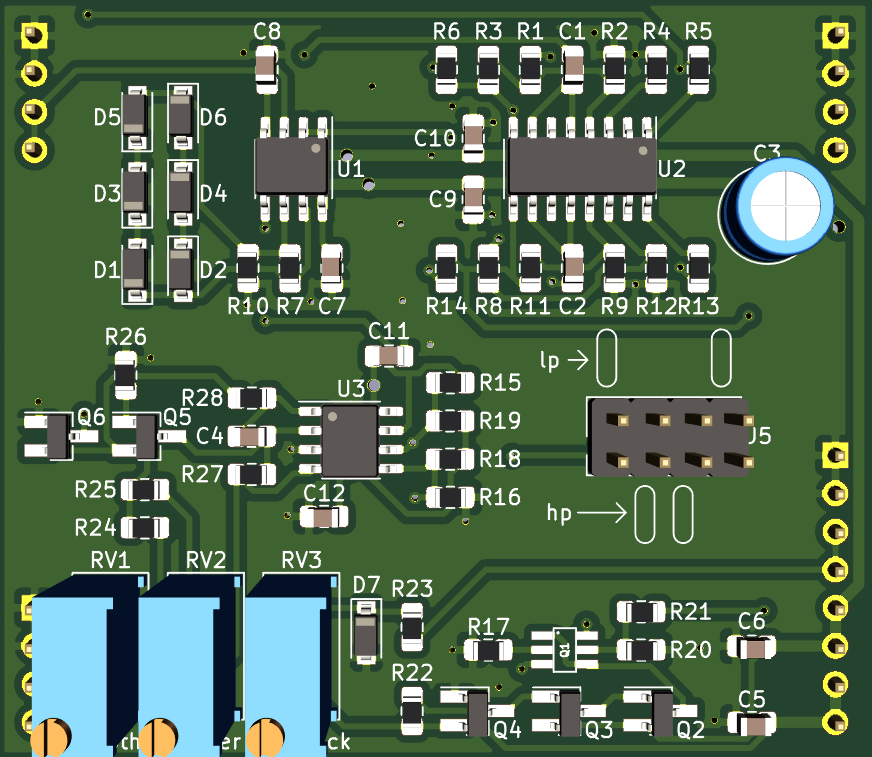

# Late MS20 style VCF Plug-In Board

Small MS20 based low pass/high pass filter PCB, designed to plug into a larger motherboard.

## Details

MS20 based LPF/HPF with voltage controlled feedback. This PCB includes the audio path and CV inputs for frequency and feedback, but does not include any modulation sources.

The intended use for this board is to plug in to a larger motherboard which contains slots for one or more of these plug-in boards, as well as modulation sources, panel controls, and input/output routing.

High pass or Low pass mode is selected by placing two jumpers as indicated on the silkscreen.

## Inputs

-Audio in: dry audio input to be filtered.

-Frequency CV in: 0 volts to +2.048 volts, higher voltage = higher sweep.

-Feedback CV in: 0 volts to +2.048 volts, higher voltage = more feedback.

## Outputs

-Audio out: filtered audio output.

## Power Supply Requirements

A bipolar 12 volt power supply is required. This will typically come from the motherboard.

## Calibration

- See the top level README for calibration instructions.
