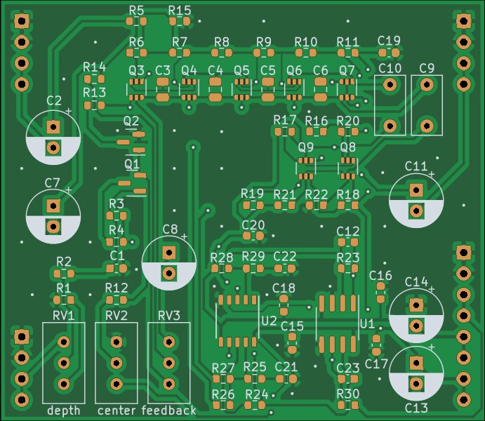

# Minimoog VCF Plug-In Board

Small Minimoog based low pass filter PCB, designed to plug into a larger motherboard.

## Details

Minimoog based LPF with Q compensation. This PCB includes the audio path and CV inputs for frequency and feedback, but does not include any modulation sources.

The intended use for this board is to plug in to a larger motherboard which contains slots for one or more of these plug-in boards, as well as modulation sources, panel controls, and input/output routing.

The Q compensation circuit keeps the passband gain from dropping too much when feedback is increased as typically happens with this type of filter. This is a matter of taste. The amount of compensation is set by R28. R28 can be increased to reduce the amount of compensation, resulting in lower passband gain at high feedback settings if a more traditional response is desired.

## Inputs

-Audio in: dry audio input to be filtered.

-Frequency CV in: 0 volts to +2.048 volts, higher voltage = higher sweep.

-Feedback CV in: 0 volts to +2.048 volts, higher voltage = more feedback.

## Outputs

-Audio out: filtered audio output.

## Power Supply Requirements

A bipolar 12 volt power supply is required. This will typically come from the motherboard.

## Calibration

- See the top level README for calibration instructions.
