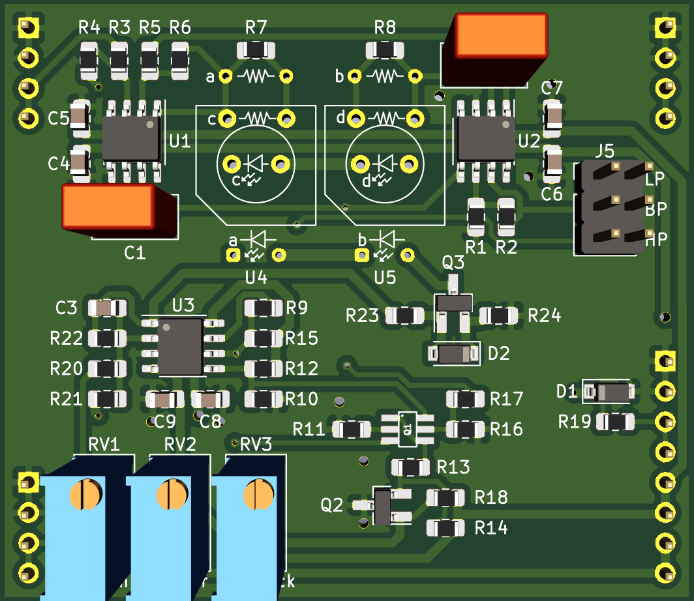
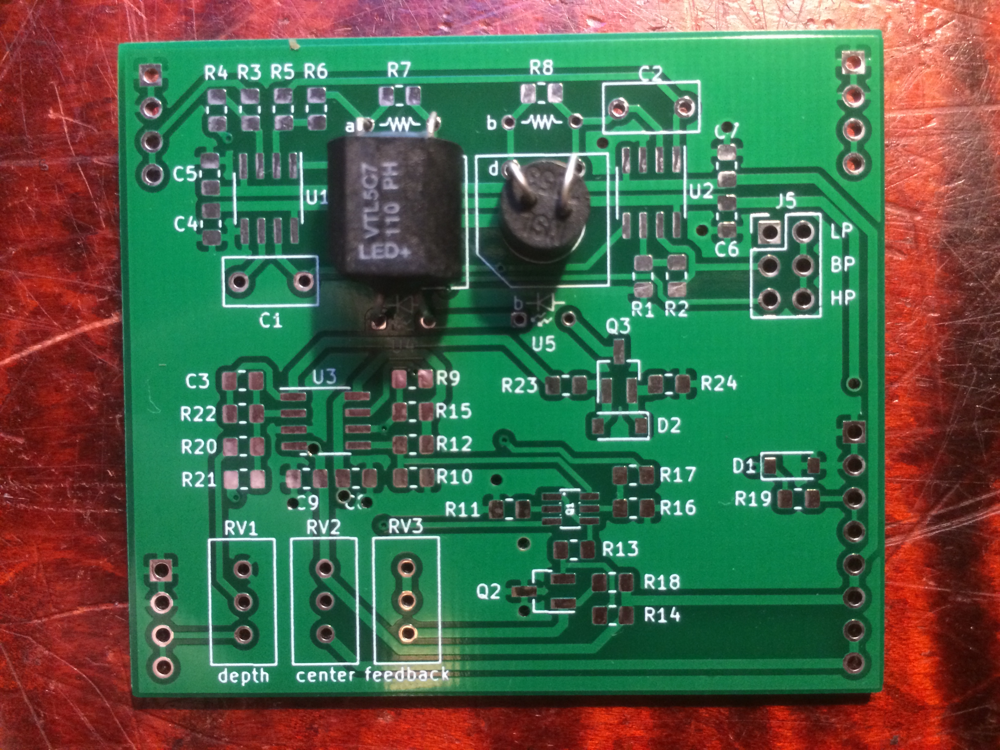

# Mutron-III Plug-In Board

Small Mutron-III based state variable filter PCB, designed to plug into a larger motherboard.

## Details

Mutron-III based SVF. This PCB includes the audio path and CV inputs for frequency and feedback, but does not include any modulation sources.

The intended use for this board is to plug in to a larger motherboard which contains slots for one or more of these plug-in boards, as well as modulation sources, panel controls, and input/output routing.

## Inputs
- Audio in: dry audio input to be filtered.
- Frequency CV in: 0 volts to +2.048 volts, higher voltage = higher sweep.
- Feedback CV in: 0 volts to +2.048 volts, higher voltage = more feedback.

## Outputs
- Audio out: filtered audio output.

## Power Supply Requirements
- A bipolar 12 volt power supply is required. This will typically come from the motherboard.

## Filter mode selection
- This filter has three filter modes available: Low Pass, Band Pass, and High Pass.
- One mode at a time can be selected with a jumper.

## Note about the vactrols
The mutron-III uses vactrols to control the filter cutoff frequency. The exact devices used have a large impact on the sound of the filter. The footprint on the pcb can accept VTLxxx type vactrols, hand rolled vactrols, or the small cylindrical NSLxxx ones like I have a million of. Because of the wide variability of vactrols, some experimentation may be needed to get the filter to sound the way you want. With the circuit as drawn, the few types of vactrols I tried all sounded good after some calibration. Some component values may need to be changed if the vactrols used have significantly different specs to the ones I tried.

The picture below shows how to install VTLxxx type and NSLxxx type vactrols:

## Calibration

- See the top level README for calibration instructions.