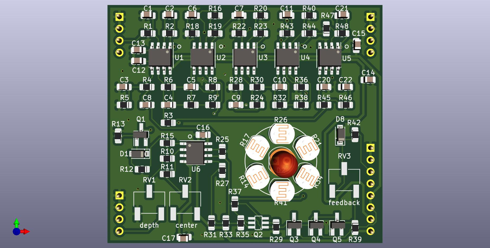

# Optical Phasor Plug-In Board

Small 6 stage optical phase shifter PCB, designed to plug into a larger motherboard.

## Details

The main circuit is based on the famous Mutron phasor circuit with the addition of voltage controlled feedback. This PCB includes the audio path and CV inputs for frequency and feedback, but does not include any modulation sources.

The intended use for this board is to plug in to a larger motherboard which contains slots for one or more of these phasor boards, as well as modulation sources, panel controls, and input/output routing.

## Inputs

-Audio in: dry audio input to be phase shifted.

-Frequency CV in: 0 volts to +2.048 volts, higher voltage = higher sweep.

-Feedback CV in: 0 volts to +2.048 volts, higher voltage = more feedback.

## Outputs

-Audio out: phase shifted audio output.

## Power Supply Requirements

A bipolar 12 volt power supply capable of supplying 50mA is needed. This will typically come from the motherboard.

## Note About The Light Dependent Resistors

Low on resistance and high off resistance are desirable if a wide sweep range is wanted. Slow/fast response is up to personal taste.

The choice of LED has a large impact on sweep depth. Diffused green LEDs were found to produce good results, but feel free to experiment.

The LED and surrounding LDRs should be protected from ambient light under an opaque cover.

## Calibration

- See the top level README for calibration instructions.